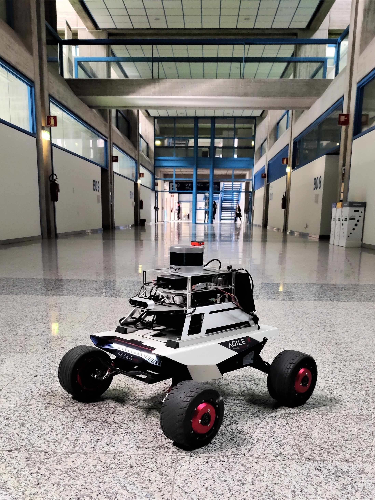
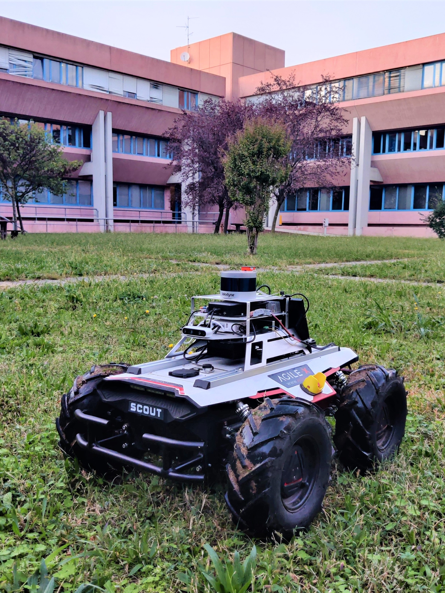
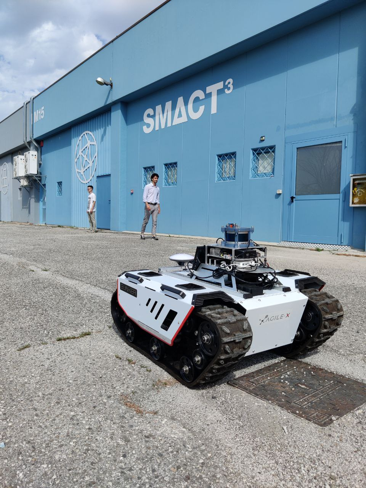
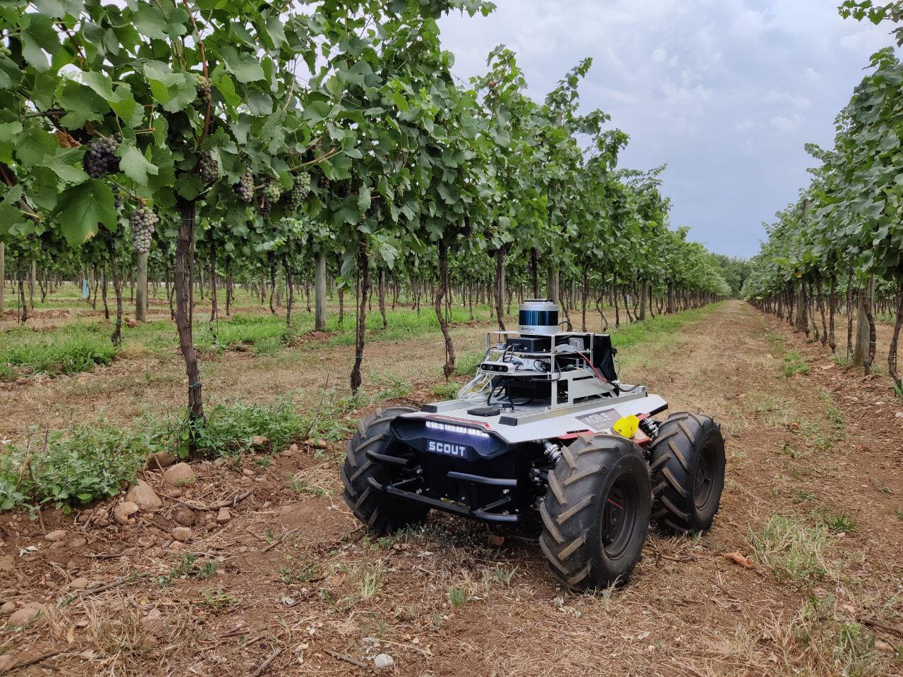

# mobile-robotics-uniud-datasets


This repository contains datasets collected using AgileX mobile robots in different scenarios. 

Data acquisition is performed with the robot moving autonomously following a predefined path (unless otherwise stated). More details on the navigation method used are reported on the related paper. 

These datasets can be exploited to test SLAM algorithms based on LiDAR, IMU, and GNSS data. 

## Sensors specifications

**LiDAR sensor**: Velodyne VLP16 (Puck) [datasheet](./datasheet/velodyne.pdf)

**9-Axis IMU**: Xsens MTi 630 [datasheet](./datasheet/MTi-630.pdf)

**GNSS receiver**: Ardusimple simpleRTK2B Budget [datasheet](https://www.ardusimple.com/simplertk2b-hookup-guide/)

**Info**: The following information applies to everything below unless otherwise stated! The Velodyne LiDAR sensor range is set to 100 m and LiDAR point clouds are published at 10 Hz in the topic *velodyne_points*. The IMU sensor reference frame is considered coincident with the LiDAR sensor reference frame, i.e., the $x$ axis points forward and the $z$ axis points upward. The magnetometer reports the pose of the robot with respect to a fixed ENU reference frame (i.e., $x$ axis points to the East, $y$ axis points to the North, and $z$ axis points up). IMU data are published at 200 Hz in the topic */imu/data*. GNSS data are published at 1 Hz in the topic */ublox_position_receiver/fix*. 


-----

## Uniud Rizzi campus - Single corridor/Squared plant

**Mobile robot**: AgileX Scout Mini

**Mobile platform specifications**: https://docs.trossenrobotics.com/agilex_scout_mini_docs/specifications.html



### Single corridor
Data acquired in a single corridor of the west wing of the Rizzi building (40 m long, 8 m wide, and 4 m high).

**Download dataset at**: [download_link](https://uniudamce-my.sharepoint.com/:u:/g/personal/diego_tiozzo_uniud_it/EbvGEXrWFihMlHSk3xHcQRwBXyPgFy4TIit5rChXjifMvw?e=Wb9pfU)

### Squared plant 
Data acquired in the whole squared plant of the west wing of the Rizzi building (80 × 80 m, measured along the center line of the corridors). During the survey new and unknown portions of the building are explored.

**Download dataset at**: [download_link](https://uniudamce-my.sharepoint.com/:u:/g/personal/diego_tiozzo_uniud_it/EXaexaymhVVDlyMibmMuPGoBpMj-5L6y5YDryUugMQBj6A?e=AlItvO)

Relevant topics list: 
```
/imu/data
/velodyne_points
```

Thank you for citing [Tiozzo Fasiolo, D et al. (2023)]([./config/doc/paper.pdf](https://www.cambridge.org/core/services/aop-cambridge-core/content/view/D5B49F3F7FC0992EE0CA3A6DD85BAAB8/S026357472300053Xa.pdf/comparing_lidar_and_imubased_slam_approaches_for_3d_robotic_mapping.pdf)) if you use any of this data.
```
@article{fasiolo2023comparing,
  title={Comparing LiDAR and IMU-based SLAM approaches for 3D robotic mapping},
  author={Fasiolo, Diego Tiozzo and Scalera, Lorenzo and Maset, Eleonora},
  journal={Robotica},
  pages={1--17},
  year={2023},
  publisher={Cambridge University Press}
}
```


-----

## Uniud Rizzi campus - Courtyard 

**Mobile robot**: AgileX Scout 2.0

**Mobile platform specifications**: https://docs.trossenrobotics.com/agilex_scout_20_docs/specifications.html



Data acquired in one of the courtyards inside the building (45 × 45 m, measured along the center line of the external corridors). The robot moves on grass and tiles cousing vibrations. 

**Download dataset at**: [download_link](https://uniudamce-my.sharepoint.com/:u:/g/personal/diego_tiozzo_uniud_it/EbE5KXq392lAuXVOBdoB9ZYBeVXxhQajDgj9loPeijtWVQ?e=kaBbnt)

Relevant topics list: 
```
/imu/data
/velodyne_points
```


Thank you for citing [Tiozzo Fasiolo, D et al. (2023)]([./config/doc/paper.pdf](https://www.cambridge.org/core/services/aop-cambridge-core/content/view/D5B49F3F7FC0992EE0CA3A6DD85BAAB8/S026357472300053Xa.pdf/comparing_lidar_and_imubased_slam_approaches_for_3d_robotic_mapping.pdf)) if you use any of this data.
```
@article{fasiolo2023comparing,
  title={Comparing LiDAR and IMU-based SLAM approaches for 3D robotic mapping},
  author={Fasiolo, Diego Tiozzo and Scalera, Lorenzo and Maset, Eleonora},
  journal={Robotica},
  pages={1--17},
  year={2023},
  publisher={Cambridge University Press}
}
```


-----

## LabVillage - Parking lot full/Parking lot SMACT3

**Mobile robot**: AgileX Bunker

**Mobile platform specifications**: https://docs.trossenrobotics.com/agilex_bunker_docs/specifications.html



### Parking lot full
The robot performs a complete scan of the rectangular Lab Village building (dimension 160 × 60 m), in the presence of walking workers and a few moving vehicles, covering a total distance of 496 m and returns to its initial position at the end of the survey.

**Download dataset at**: data will be available as soon as the paper is published :(

### Parking lot SMACT3
The robot performs two laps along a rectangular path for a total distance of 142 m, while two people walk in and out of the building through two entrance doors and another person walks back and forth in the parking lot. 

**Download dataset at**: data will be available as soon as the paper is published :(

Topics list: 
```
/imu/data
/tf
/ublox_position_receiver/fix
/velodyne_points
```

**Info**: Be careful! Poses published in the *tf* topic are also available in this dataset. Do not play that topic if you are using another localization algorithm. Use for instance: 

```
rosbag play [bagfilename] --topic [topicname1] [topicname2]
```

## Servadei vineyard 2022 - June/July/December

**Mobile robot**: AgileX Scout 2.0

**Mobile platform specifications**: https://docs.trossenrobotics.com/agilex_scout_20_docs/specifications.html



**Download dataset at**: data will be available as soon as the paper is published :(

```
/imu/data
/velodyne_points
```

**Info**: During this data acquisition campaign the robot was teleoperated. Be careful! IMU data may be degradated since the port was not set at low latency. 

Other dataset acquired in vineyard, with reliable IMU data and additional GNSS data, will be available soon!

-----


